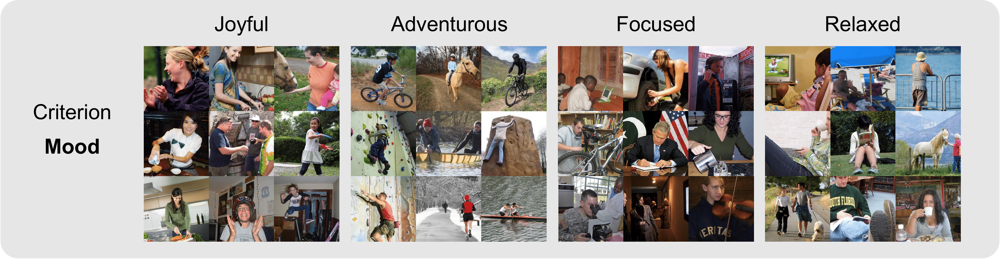

# IC|TC: Image Clustering Conditioned on Text Criteria
*New methodology for performing image clustering based on user-specified criteria in the form of text by leveraging modern Vision-Language Models and Large Language Models.* [arXiv Link](https://arxiv.org/abs/2310.18297).

## 📣 News
- Our paper is accepted in ICLR'24. See you in Vienna!
- Our paper will be presented at NeurIPS workshop on [R0-FoMo: Robustness of Few-shot and Zero-shot Learning in Foundation Models](https://sites.google.com/view/r0-fomo), 2023. See you there!

## 📕 Overview of IC|TC
#### Sample images from clustering results of IC|TC
Sample images from clustering results of IC|TC. The method finds clusters consistent with the user-specified text criterion. Furthermore, the method provides cluster names (texts above each image cluster) along with the clusters, enhancing the interpretability of clustering results.
<div align="center">

</div>

<div align="center">

</div>

<div align="center">

</div>
<div align="center">

</div>

<div align="center">

</div>

#### Pipeline of IC|TC
IC|TC is very simple. All you need to do is input a text prompt reflecting the clustering criteria to the Vision Language Model (VLM) and Large Language Model (LLM) at each step.

<div align="center">

</div>

(Step 1) VLM extracts detailed relevant textual descriptions of images. (Step 2) LLM identifies the names of the clusters. (Step 3) LLM conducts clustering by assigning each description to the appropriate cluster. The entire procedure is guided by a user-specified text criterion ($\mathbf{TC}$). (Optional $\mathbf{TC}$ Refinement). The user can update the text criterion if the clustering results are unsatisfactory. 

## 📖 Contents
- [Install](#install)
- [Dataset Prep](#dataset-prep)
- [Usage](#usage)

## 💾 Install

1. Clone this repository
```bash
git clone https://github.com/sehyunkwon/ICTC.git
cd ICTC
```

2. Install Packages
```Shell
conda create -n ictc python=3.10 -y
conda activate ictc
pip install --upgrade pip  # enable PEP 660 support
pip install -e .
```

## 🔨 Dataset Prep
This section explains how to prepare the images that we used. The images have to be in **.jpg**, **.JPEG**, or **.png** format (you can add more in **load_image_paths_from_folder** function from **models.py** file). The image names have to be in the following format: {IMG_NUMBER}_{CLASS_NAME}.{FORMAT}.

### MNIST
```
mkdir -p ~/data/mnist
cd ~/data/mnist
git clone https://github.com/rasbt/mnist-pngs.git
mv mnist-pngs/test/* .
rm -rf mnist-pngs
cd ~/ICTC/scripts
./mnist.sh
```

### CIFAR10
```
mkdir -p ~/data/cifar10
cd ~/data/cifar10
wget http://pjreddie.com/media/files/cifar.tgz
tar xzf cifar.tgz
mv ./cifar/test/* .     # only use test set
rm -rf cifar*
```

### CIFAR100
```
pip install cifar2png
cifar2png cifar100superclass ~/data/cifar100/
cd ~/data/cifar100/
rm -rf train/
mv ./test/* .     # only use test set
rm -rf test/
cd ~/ICTC/scripts
./cifar100.sh            # change the file format
```
### STL10
```
mkdir -p ~/data/stl10/
cd ~/ICTC/scripts
python stl10_download.py
cd ~/data/stl10/
rm -rf stl10_binary*
cd ~/ICTC/scripts
python stl10.py         # change the file format
cd ~/data/stl10/
rm -rf test/*/
```

### Stanford-40-actions
```
mkdir -p ~/data/stanford-40-actions
cd ~/data/stanford-40-actions
wget http://vision.stanford.edu/Datasets/Stanford40_JPEGImages.zip
unzip Stanford40_JPEGImages.zip
rm -rf Stanford40_JPEGImages.zip
cd ~/ICTC/scripts
./stanford.sh
```

### Location and Mood labels of Stanford-40-actions dataset
[Google Drive Link](https://drive.google.com/drive/folders/1dgy_t48xtmRt9ovsiAVHYAWWMVzHghZJ?usp=drive_link)


### PPMI (People Playing Musical Instruments)
The 7 subclasses are: saxophone, guitar, trumpet, cello, flute, violin and harp
```
mkdir -p ~/data/ppmi
cd ~/data/ppmi
wget http://vision.stanford.edu/Datasets/norm_ppmi_12class.zip
unzip norm_ppmi_12class.zip
rm -rf norm_ppmi_12class.zip README
rm -rf norm_image/with_instrument
rm -rf ./*/*/train
mv ./norm_image/play_instrument/*/test/* .
rm -rf norm_image/
cd ~/ICTC/scripts
./ppmi.sh
cd ~/data/ppmi
mkdir 12_classes
mkdir 7_classes
mkdir 2_categories
cd ~/ICTC/scripts
cp * ~/data/ppmi/12_classes
cp *_Saxophone.jpg *_Guitar.jpg *_Trumpet.jpg *_Cello.jpg *_Flute.jpg *_Violin.jpg *_Harp.jpg ./7_classes
cp ./7_classes/* ./2_categories
cd ~/ICTC/scripts
./2_categories.sh
```

## 💻 Usage
Assuming the current directory is **~/ICTC**.

#### **1. Obtain image description from VLM** (Step 1)
Image descriptions will be saved in **'./{dataset}/{llm}/{vlm}/step1_result.jsonl'**.
```
python step1/llava/eval/model.py --dataset cifar10
or
python step1/blip2/model.py --dataset cifar10
```

#### **2. Obtain labels from VLM descriptions using LLM** (Step 2a)
From the description of the image provided by VLM, ask LLM for a possible label.
```
python ictc/step2a.py --dataset cifar10
```
To use GPT-4, enable **args.use_gpt4**. Or to use Llama-2, enable **args.llama**

#### **3. Cluster possible labels to N labels using LLM** (Step 2b)
Using the saved file containing initial labels, ask LLM to summarize them into K classes.
```
python ictc/step2b.py --dataset cifar10
```

#### **4. Final classification(=clustering)** (Step 3)
Now you obtained K classes. Feed LLM with image description and a list of possible classes. Obtain the final classification.
```
python ictc/step3.py --dataset cifar10
```

#### **5. Measuring acc, ari, nmi using the Hungarian Matching algorithm**
Classic metrics used in clustering literature.
```
python ictc/measuring_acc.py --dataset cifar10
```

## 📌 Citation
If you feel IC|TC useful for your research and applications, please cite using this BibTeX:
```
@article{
kwon2024ictc,
title={Image Clustering Conditioned on Text Criteria},
author={Sehyun Kwon and Jaeseung Park and Minkyu Kim and Jaewoong Cho and Ernest K. Ryu and Kangwook Lee},
journal={International Conference on Learning Representations},
year={2024}
}
```
